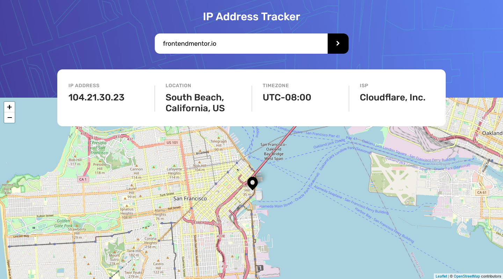
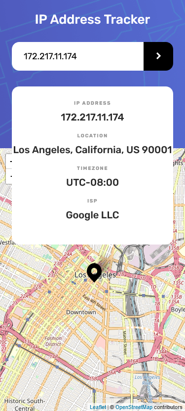

# Frontend Mentor - IP address tracker solution

This is a solution to the [IP address tracker challenge on Frontend Mentor](https://www.frontendmentor.io/challenges/ip-address-tracker-I8-0yYAH0). Frontend Mentor challenges help you improve your coding skills by building realistic projects.

## Table of contents

- [Overview](#overview)
  - [The challenge](#the-challenge)
  - [Screenshot](#screenshot)
  - [Links](#links)
- [My process](#my-process)
  - [Built with](#built-with)
  - [What I learned](#what-i-learned)

### The challenge

Users should be able to:

- View the optimal layout for each page depending on their device's screen size
- See hover states for all interactive elements on the page
- See their own IP address on the map on the initial page load
- Search for any IP addresses or domains and see the key information and location

### Screenshot

Desktop

Mobile

### Links

- Solution URL: [repo](https://github.com/fayax555/ip-address-tracker)
- Live Site URL: [live](https://ip-address-tracker-fayax555.vercel.app)

### Built with

- [React](https://reactjs.org/) - JS library.
- [Next.js](https://nextjs.org/) - React framework.
- [TypeScript](https://www.typescriptlang.org/) - JavaScript with syntax for types.
- [IP Geolocation API](https://geo.ipify.org/) - Geolocation data
- [Leaflet](https://leafletjs.com/) - Interactive maps
- [React Leaflet](https://react-leaflet.js.org/) - React components for Leaflet maps
